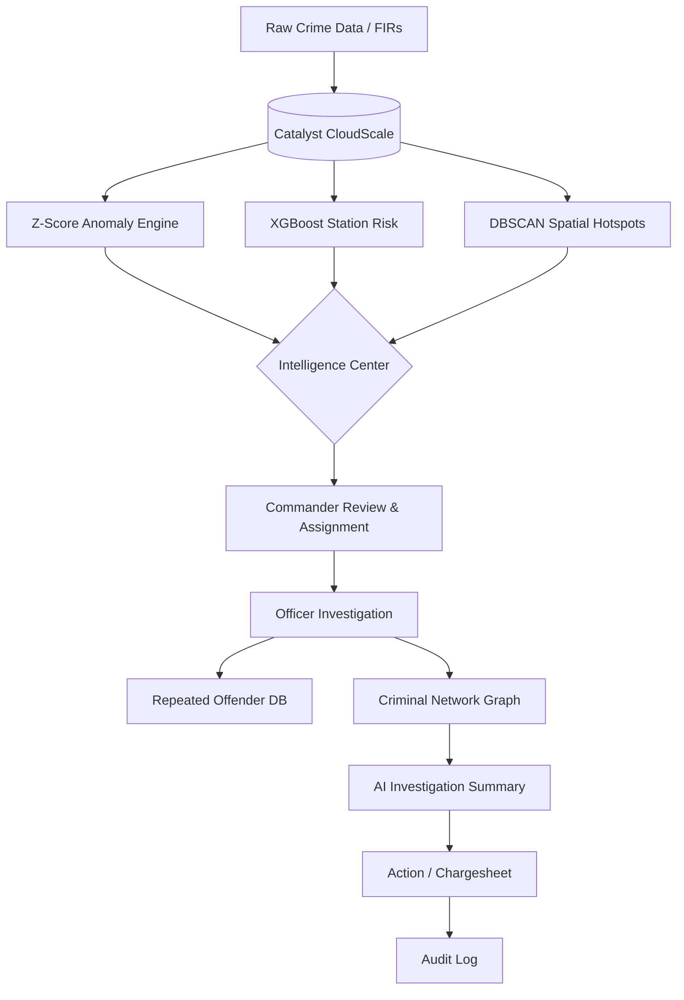
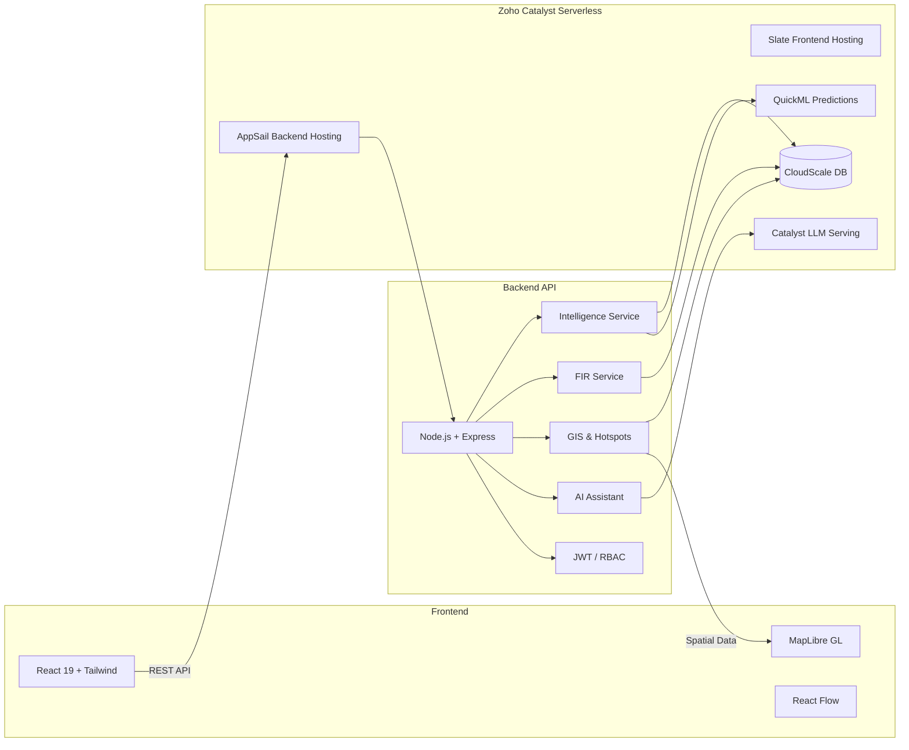

# Karnataka State Police (KSP) Crime Intelligence & AI Platform

> **AI-driven crime intelligence, prediction, investigation and visualization for Karnataka Police.**

This project is a production-ready, full-stack crime intelligence platform built for the **Karnataka State Police (KSP)**. The platform combines official government UI standards with modern analytics, GIS mapping, AI risk profiling, and case workflow tools, securely powered by **Zoho Catalyst**.

<div align="center">
  
  
  
  
</div>

---

## Table of Contents
1. [Problem Statement](#2-problem-statement)
2. [Solution](#3-solution)
3. [Key Features](#4-key-features)
4. [AI & Analytics](#5-ai--analytics)
5. [AI Investigation Workflow](#6-ai-investigation-workflow)
6. [System Architecture](#7-system-architecture)
7. [Technology Stack](#8-technology-stack)
8. [Data Model](#9-data-model)
9. [Investigation Workflow](#10-investigation-workflow)
10. [GIS Intelligence](#11-gis-intelligence)
11. [Criminal Network](#12-criminal-network)
12. [Security](#13-security)
13. [Catalyst Services Used](#14-catalyst-services-used)
14. [Repository Structure](#15-repository-structure)
15. [Setup & Installation](#16-setup--installation)
16. [Deployment](#17-deployment)
17. [API Overview](#18-api-overview)
18. [Demo Flow](#19-demo-flow)
19. [USP (Unique Selling Proposition)](#20-usp-unique-selling-proposition)
20. [Future Scope](#21-future-scope)
21. [Team](#22-team)
22. [License](#23-license)

---

## 2. Problem Statement
**Challenges in Modern Policing:**
* **Scale of Data:** The KSP handles massive volumes of daily crime reports, making it difficult for human analysts to spot emerging micro-trends or statistical anomalies in real-time.
* **Siloed Intelligence:** Identifying repeat offenders and their networks is challenging when FIRs are isolated text records without relationship mapping.
* **Resource Allocation:** Police commanders struggle to identify which specific police stations face an imminent surge in specific crime categories, leading to reactive rather than proactive policing.
* **Manual Investigation:** Analyzing the connections across hundreds of case files requires extensive manual labor, slowing down critical investigations.

There is a dire need for an integrated system that provides actionable intelligence rather than static reporting.

---

## 3. Solution
Our platform acts as a complete, integrated intelligence system that shifts policing from reactive to proactive:

* **Detect:** Real-time dashboards monitor state-wide crime levels.
* **Predict:** XGBoost models forecast crime risk at the individual police station level.
* **Explain:** Z-score anomaly algorithms flag unnatural spikes in crime categories.
* **Investigate:** Officers manage FIR workflows, evidence, and chargesheets natively.
* **Connect:** Graph visualizations map relationships between accused, victims, and multiple cases.
* **Locate:** Spatial clustering (DBSCAN) identifies 2km hotspot red-zones for targeted patrolling.
* **AI Assist:** Tool-augmented Data-RAG securely queries the database to answer natural language officer questions and summarize investigations.
* **Act:** Commanders dispatch resources and officers execute workflows based on intelligence.
* **Audit:** Every critical action is immutably logged to ensure chain-of-custody and accountability.

---

## 4. Key Features

| Module | Description |
| :--- | :--- |
| **Dashboards** | Role-based (Admin, Officer, Analytics) real-time metric visualizations. |
| **Police Stations** | Unit management with dynamic risk profiling. |
| **Officers** | Employee management and assignment tracking. |
| **FIRs & Cases** | End-to-end case lifecycle management and reporting. |
| **Analytics** | Deep-dive statistical charts comparing historical vs current crime trends. |
| **GIS Maps** | MapLibre-powered spatial analysis of FIR locations and jurisdictions. |
| **Criminal Network** | Interactive node-based graph mapping of offenders, victims, and cases. |
| **Intelligence Center** | Centralized hub for automated AI alerts and anomaly reports. |
| **AI Anomaly Detection** | Z-score-based alerting for sudden spikes in crime types within a district. |
| **Repeated Offenders** | Automated identification of criminals linked to multiple active FIRs. |
| **AI Assistant** | Natural language Data-RAG chat interface for querying case specifics. |
| **Audit Logs** | Immutable tracking of user actions across the platform. |
| **Station Risk Prediction** | 7-day predictive crime risk scoring for individual stations using XGBoost. |
| **Crime Hotspots** | Spatial clustering algorithm (DBSCAN) generating 2km risk red-zones. |
| **Investigation Summary** | AI-generated automated summaries of complex cases. |

---

## 5. AI & Analytics

### Z-Score Anomaly Detection
The system continuously monitors case volumes across all districts and crime heads. It establishes a **temporal baseline** (historical mean and standard deviation) and flags any region where recent 7-day activity exceeds a standard Z-score threshold (e.g., > 2.0). These spikes are classified by severity (Elevated, High, Critical) and instantly fed into the **Intelligence Center** for commander review.

### XGBoost Station Risk Prediction
Powered by Catalyst QuickML, the system utilizes a trained XGBoost model to predict the 7-day crime risk level of individual police stations. The model evaluates input features including:
* 7-day, 30-day, and 90-day historical case counts
* Week-over-week growth rates
* Categorical breakdowns (Property, Body, Economic, Cyber, etc.)
* Repeat offender ratios and unique accused counts

### DBSCAN Hotspot Detection
To identify spatial patterns, the system runs the **DBSCAN** spatial clustering algorithm over recent FIR coordinates. It requires a minimum density (`minPts=3`) within a specific radius (`eps=2.0 km`). Clusters meeting these criteria are flagged as "Hotspots" and visualized as red zones on the GIS Map, directing physical patrol units to high-risk areas.

### AI Investigation Assistant
The platform features an advanced **Tool-augmented RAG (Retrieval-Augmented Generation)** architecture powered by Catalyst LLM integration:

`User Query → AI Planner → Tool Selection (Find Docs / Aggregate) → CloudScale Execution → Grounded Context → GLM Model → Final Response`

This allows officers to ask natural language questions (e.g., "Show me recent theft cases in Koramangala") and receive answers securely grounded strictly in the live operational database.

---

## 6. AI Investigation Workflow



---

## 7. System Architecture



---

## 8. Technology Stack

| Layer | Technology |
| :--- | :--- |
| **Frontend** | React 19, TypeScript, Vite, Tailwind CSS, Lucide React, Recharts |
| **Backend** | Node.js (v22), Express.js, TypeScript |
| **Database** | Zoho Catalyst CloudScale (NoSQL) |
| **AI / ML** | Zoho Catalyst QuickML (XGBoost), Zoho Catalyst LLM, Google GenAI |
| **GIS / Mapping**| MapLibre GL, Leaflet |
| **Graphs** | React Flow |
| **Authentication** | JWT (HttpOnly Cookies), RBAC Middleware |
| **Hosting** | Zoho Catalyst AppSail (Backend), Zoho Catalyst Slate (Frontend) |
| **CI / CD** | Catalyst DevOps Pipelines, GitHub Actions |

---

## 9. Data Model
The database mirrors the official KSP ER diagram and is implemented in Catalyst CloudScale:

* **CaseMaster:** The central entity storing FIR details, timestamps, categories, coordinates, and statuses.
* **Accused & Victims:** Personal details of individuals involved in the case.
* **Complainants:** Reporter details.
* **ActSectionAssociations:** Junction table linking cases to specific IPC/BNS acts and sections.
* **Employees & Units:** Police officers and Police Station (Unit) configurations.
* **Districts:** Administrative regional boundaries.
* **CustomEdges:** User-generated relationship links for the Criminal Network visualization.
* **AuditLogs:** Immutable records of user login and mutation events.

---

## 10. Investigation Workflow
The platform digitizes the entire lifecycle of an FIR:
1. **FIR Registration:** Case is logged with geospatial coordinates and initial facts.
2. **Case Details:** Officers track the ongoing status of the case.
3. **Timeline Notes:** Chronological logging of investigation updates.
4. **Evidence:** Tracking of related evidence and documentation.
5. **Chargesheet:** Final submission of the case findings.
6. **Status & Reassignment:** Cases can be transferred between officers or closed natively.
7. **Audit Trail:** Every status change and login is securely tracked.

---

## 11. GIS Intelligence
Geospatial data is a first-class citizen in the platform. Using **MapLibre GL**, the platform plots all active FIRs on a high-performance interactive map. The backend actively runs **DBSCAN** algorithms over recent cases to generate 2-kilometer red-zone "Hotspots" which are drawn directly onto the map, allowing commanders to visually identify overlapping crime waves and assign patrols effectively.

---

## 12. Criminal Network
A highly interactive node-based graph visualization built with `React Flow`. 
* **Entities:** FIRs, Accused, and Victims act as nodes.
* **Relationships:** The system automatically draws edges between a Case and its associated Accused/Victims.
* **Investigation:** Officers can manually add "Custom Edges" to link previously unassociated suspects to cases based on field intelligence.

---

## 13. Security
* **Authentication:** Stateless authentication using cryptographically signed **JSON Web Tokens (JWT)**.
* **Token Transport:** Secure implementation using short-lived Access Tokens and long-lived Refresh Tokens stored in `httpOnly` cookies, preventing extraction.
* **Authorization:** Role-Based Access Control (RBAC) middleware ensures officers cannot access State Admin endpoints.
* **Audit Logging:** All critical data mutations trigger an automatic audit log entry identifying the actor, timestamp, and action taken.

---

## 14. Catalyst Services Used

The backbone of this application heavily utilizes the **Zoho Catalyst Serverless Ecosystem**:

* **Catalyst CloudScale:** Acts as the primary NoSQL operational database storing all FIRs, entities, and logs.
* **Catalyst QuickML:** Hosts and serves the trained XGBoost model used for Police Station risk prediction.
* **Catalyst LLM Serving:** Powers the AI Investigation Assistant for natural language querying.
* **Catalyst AppSail:** Serverless hosting environment running the Node.js Express backend.
* **Catalyst Slate:** Global CDN hosting for the optimized Vite/React frontend build.
* **Catalyst DevOps Pipelines:** Automated CI/CD for deployments.

---

## 15. Repository Structure

```text
datathon2/
├── backend/                  # Node.js API server
│   ├── data/                 # Seed scripts, datasets, and migration tools
│   ├── src/
│   │   ├── ai/               # Data-RAG, LLM integrations, AI Planner
│   │   ├── controllers/      # Route logic
│   │   ├── middleware/       # Auth and RBAC
│   │   ├── repositories/     # CloudScale DB adapters
│   │   ├── routes/           # API endpoints
│   │   └── services/         # Business logic (XGBoost, Hotspots, Anomaly)
│   └── package.json
├── frontend/                 # React SPA
│   ├── data/                 # Local mock datasets (fallback mode)
│   ├── src/
│   │   ├── components/       # Reusable UI elements
│   │   ├── config/           # API configurations
│   │   ├── context/          # React Auth Context
│   │   ├── pages/            # View routes (Admin, Officer, Analytics)
│   │   └── utils/            # GeoUtils, API fetch wrappers
│   └── package.json
├── catalyst.json             # Zoho Catalyst deployment config
└── README.md
```

---

## 16. Setup & Installation

### Prerequisites
* Node.js (v20 or higher)
* Catalyst CLI (`npm install -g zcatalyst-cli`)

### Clone the Repository
```bash
git clone https://github.com/Vrushant01/Datathon.git
cd Datathon
```

### Backend Setup
```bash
cd backend
npm install
npm run dev
```
*(The backend will start on `http://localhost:5000`)*

### Frontend Setup
```bash
cd frontend
npm install
npm run dev
```
*(The frontend will start on `http://localhost:5173`)*

---

## 17. Deployment
The platform is fully configured for serverless deployment on Zoho Catalyst.
* **Frontend:** Deployed to **Catalyst Slate** via `npm run build`.
* **Backend:** Deployed to **Catalyst AppSail**.

Deployment is handled automatically via **Catalyst DevOps pipelines** configured in the repository.

---

## 18. API Overview
Major implemented endpoints include:
* `/api/auth/*`: Login, Logout, Session Refresh.
* `/api/admin/*`: Station management, Officer assignment.
* `/api/cases/*`: FIR retrieval, status updates, evidence upload.
* `/api/ai/*`: Tool-augmented Data-RAG endpoints.
* `/api/hotspots/*`: DBSCAN spatial clustering execution.
* `/api/station-risk/*`: QuickML XGBoost model inference.
* `/api/network/*`: Criminal graph edge management.

---

## 19. Demo Flow
To evaluate the platform, follow this logical investigation sequence:
1. **Dashboard:** View high-level metrics and current active cases.
2. **Intelligence Center:** Check for auto-generated Z-Score anomalies (e.g., a spike in theft).
3. **Station Risk:** Review the XGBoost 7-day risk prediction for the affected stations.
4. **GIS Map:** Observe the generated DBSCAN Hotspot red-zones in the affected district.
5. **Repeated Offenders:** Identify criminals active in that specific district.
6. **Criminal Network:** Visually map the connections between the repeat offender and recent FIRs.
7. **AI Assistant:** Ask the AI to summarize the modus operandi of the identified cases.
8. **Officer Action:** Navigate to the specific FIR and update the status to "Charge Sheeted".

---

## 20. USP (Unique Selling Proposition)
Unlike traditional dashboard reporting tools, this platform **integrates predictive, spatial, and generative AI directly into the operational workflow**. Instead of an officer looking at a static report and guessing the cause, the platform:
1. Automatically flags the anomaly (Z-score).
2. Spatially locates it (DBSCAN).
3. Predicts if it will continue (XGBoost).
4. Provides a natural language interface (LLM) to investigate the root cause interactively.
5. Creates an immutable Audit trail for every resulting action.

---

## 21. Future Scope
* **Live CCTV Integration:** Routing video feeds into the GIS mapping interface.
* **Mobile App:** A native application for field officers to access the Criminal Network on the go.
* **Advanced Document OCR:** Automatically parsing physical FIR scans into the database.
* **Public Portal Enhancements:** Allowing citizens to track their non-sensitive case statuses securely.

---

## 22. Team
* **Vrushant Patil** - Lead Developer & Architect
* *(Developed for the KSP Datathon)*

---

## 23. License
Proprietary / Restricted to Datathon evaluation use only.
